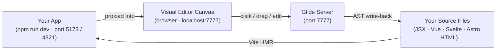
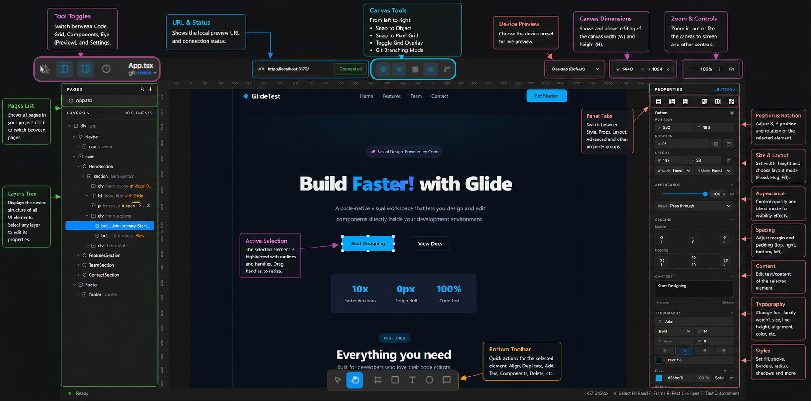

<p align="center">
  
</p>

<p align="center">
  <strong>Local visual design tool for React, Vue, Svelte &amp; Astro.</strong><br>
  Click any element on a live canvas, edit styles and layout visually,<br>
  and Glide writes the changes directly back to your source code — no cloud, no proprietary formats.
</p>

<p align="center">
  <a href="https://github.com/SrivarsanK/Glide/releases"></a>
  
  
  
</p>

---

## What is Glide?

**Glide** is a local visual design tool that sits on top of your existing frontend app. You open it in your browser, click on any element on screen, and edit its styles, layout, and position — just like Figma. The difference? **Every edit is written directly back to your source code** (JSX, TSX, Vue SFC, Svelte, Astro, or HTML) as real code.

No cloud. No proprietary formats. No lock-in. Just your code, edited visually.

---

## How It Works



1. Your app runs normally (e.g., `npm run dev` on port 5173)
2. Glide's server connects to it and opens a visual editor at `localhost:7777`
3. You click elements on the canvas → Glide highlights them and shows their styles
4. You change a value → Glide rewrites the source file using AST transformations

---

## Quick Start

### Prerequisites

- **Node.js** v18+
- **npm** v8+
- **GitHub Packages Registry Configuration**

  Since this package is hosted on GitHub Packages under the `@srivarsank` scope, you need to configure npm to route requests to GitHub:

  **Step 1** — Add to `.npmrc` in your project root (or `~/.npmrc` globally):
  ```ini
  @srivarsank:registry=https://npm.pkg.github.com
  ```

  **Step 2** — Authenticate with a GitHub Personal Access Token (PAT) with `read:packages` scope:
  ```bash
  npm login --registry=https://npm.pkg.github.com
  # Username: your GitHub username
  # Password: your GitHub PAT
  ```

---

### Method 1: Run via npx (Easiest)

Once the registry is configured, point Glide at any running frontend project — no cloning needed.

```bash
# Terminal 1 — your app
npm run dev

# Terminal 2 — Glide
npx @srivarsank/glide 5173
```

Then open **http://localhost:7777** in your browser.

> Replace `5173` with whatever port your frontend app is using.

---

### Method 2: Local Development & Source Build

If you want to run Glide from source:

```bash
# 1. Clone and install
git clone https://github.com/SrivarsanK/Glide.git
cd Glide
npm install

# 2. Build
npm run build

# 3. Start your frontend app in another terminal, then:
node dist/cli.js 5173
```

Open **http://localhost:7777** to start editing.

---

## Features

<p align="center">
    
</p>

| Feature | Description |
|---|---|
| 🎨 **Visual Canvas** | Figma-like workspace — select, drag, resize, zoom, and pan elements |
| 📐 **Smart Snapping** | Snaps to sibling edges, centers, and pixel grid with live guide lines |
| ✍️ **Universal Live Code Write-back** | Real-time direct source editing across React (JSX/TSX), Vue (SFC), Svelte, Astro, and HTML — for Tailwind classes, inline styles, and text content |
| 🚀 **Astro Framework Support** | Native support for `.astro` SFCs with server frontmatter preservation |
| ⚡ **Zero-Flicker Drag** | Positions written to `glide-positions.json` — no HMR reload on drag |
| 🗂️ **Layers Panel** | Hierarchical tree view of all elements with Figma-style hover controls |
| 🎛️ **Properties Panel** | Edit geometry (X, Y, W, H), spacing, border, radius, shadows, fills, and typography |
| 🌈 **Color Picker** | Custom popup with 16 presets and hex input — no native OS dialog |
| 📱 **Device Preview** | Switch between device presets or set a custom width & height |
| 🌿 **Git Branching Mode** | Safe sandbox (`git: <branch> ▾`) to preview changes before committing |
| 🎛️ **Quick Toggles Navbar** | Snapping, grid, rulers, and repo view in a compact header toolbar |
| ↩️ **Undo / Redo** | Full undo/redo history for the entire session |
| 🗂️ **Component Registry** | Auto-scans and indexes every component into `glide-components.json` at startup |

---

## Color Picker

Glide uses a **custom popup color picker** (not the native OS dialog). Click any color swatch to open it. You can:
- Pick from 16 preset colors
- Type a hex code directly
- Use the **🧪 eyedropper button** to sample a color from the screen

> ⚠️ **Known Bug — Eyedropper Tool:** The eyedropper (`🧪`) is currently buggy in some Chromium versions. It may not close the color picker or register the sampled color. **Use hex input or presets instead.**

---

## Keyboard Shortcuts

| Key | Action |
|---|---|
| `V` | Select tool |
| `H` | Hand / Pan tool |
| `F` | Frame |
| `R` | Rectangle |
| `O` | Ellipse |
| `T` | Text |
| `C` | Comment |
| `Ctrl+Z` | Undo |
| `Ctrl+Shift+Z` | Redo |
| `Escape` | Deselect / Close popup |

---

## Project Structure

```
Glide/
├── packages/
│   ├── cli/            # Entry point — run this to start Glide
│   ├── overlay/        # Visual editor UI (HTML/JS at localhost:7777)
│   ├── server/         # WebSocket + HTTP server that connects to your app
│   ├── core/           # Shared types, AST scanner, component registry
│   ├── ast-writer/     # Writes style changes back to source files
│   ├── adapters/       # Framework adapters (vue, svelte, astro, html, react)
│   └── vite-plugin/    # Stamps elements with source locations (data-gl-source)
├── skills/             # AI agent skills shipped with the package
│   └── glide-component-segregator/
├── docs/               # Extra documentation and design specs
├── logo/               # Logo assets
└── README.md
```

---

## AI Agent Skills

Glide ships a **built-in AI agent skill** with every install. It teaches AI coding assistants — like [Antigravity IDE](https://antigravity.dev) — how to use `glide-components.json` to find and edit any component by name, without guessing file paths or re-scanning the source tree.

### How it works

When Glide starts, it scans your project and writes `glide-components.json` to your project root. Every component — including layout wrappers and background elements — gets its own entry with file path, line number, and a list of all its HTML elements:

```json
{
  "buckets": [
    {
      "name": "Card",
      "file": "/src/components/Card.tsx",
      "exportType": "named",
      "line": 12,
      "elements": [
        { "id": "src/Card.tsx:13:4", "tagName": "div", "isRoot": true, "classNames": ["card"] },
        { "id": "src/Card.tsx:14:6", "tagName": "h2", "isRoot": false }
      ],
      "cssFiles": ["/src/components/Card.module.css"]
    }
  ]
}
```

The registry **auto-updates within 300 ms** whenever you add, rename, or delete a source file — no manual rescan needed.

### Supported frameworks

| Framework | Export types detected | Single File Component (SFC) Support |
|---|---|---|
| React / TSX | Named, default, arrow function, anonymous JSX | JSX AST parsing |
| Vue SFC | `.vue` files — `<template>` block scanned | Full template class write-back |
| Svelte | `.svelte` files — `<script>` / `<style>` stripped | Full template class write-back |
| Astro | `.astro` files — Frontmatter (`---`) preserved | Full template class & text write-back |
| HTML | `<head>`, `<script>`, `<style>` excluded | DOM attribute write-back |

### Installation

**Antigravity IDE — automatic.**
The skill at `skills/glide-component-segregator/SKILL.md` is picked up automatically when you install Glide.

**Other AI tools — one command:**
```bash
# Run from your project root after installing @srivarsank/glide
cp node_modules/@srivarsank/glide/skills/glide-component-segregator/SKILL.md \
   .agents/skills/glide-component-segregator/SKILL.md
```

> [!NOTE]
> Add these generated files to your `.gitignore`:
> ```gitignore
> glide-components.json
> glide-positions.json
> ```

### Agent workflow

Once active, the agent follows this 6-step pattern for every component edit:

```
1. Read glide-components.json
2. Find the bucket by component name (e.g. "Card", "Header")
3. Inspect elements — target by isRoot / tagName / classNames
4. Use element.id as the data-gl-source edit target
5. For CSS edits — open the file listed in bucket.cssFiles
6. After adding a new component — wait 300 ms, then re-read the registry
```

---

## Known Issues & Limitations

| Feature / Issue | Status |
|---|---|
| 🎨 **Eyedropper tool** | ✅ Fixed (state restoration fixed; Chromium 150 freeze bug guarded) |
| 📐 **Element resizing** | ✅ Fixed (generation sync + instant state resync) |
| ⚡ **Vue / Svelte / Astro editing** | ✅ Fully Supported (class, style, and text writeback across all 5 frameworks) |
| 🏷️ **Source Stamping** | By design (`data-gl-source` tagged automatically by Vite plugin) |
| 📍 **Drag Positions** | By design (stored in `glide-positions.json` for zero-flicker live drag) |

---

## License

This project is licensed under the [Apache License 2.0](LICENSE).