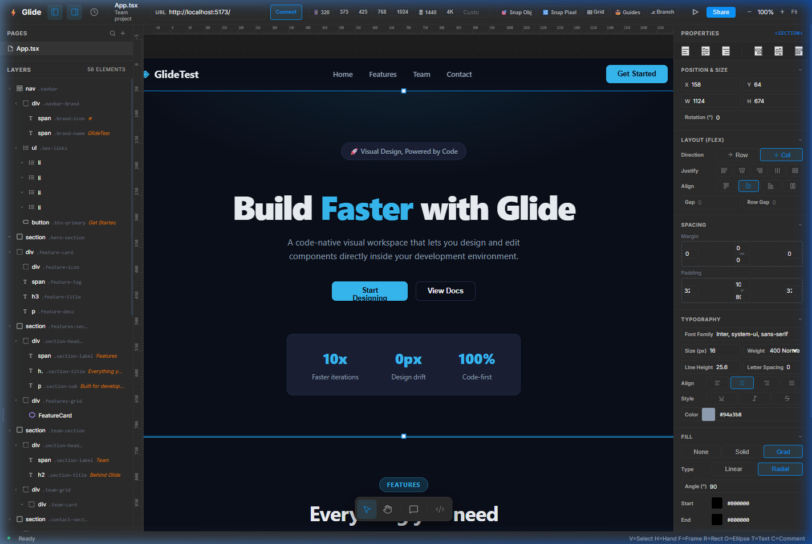
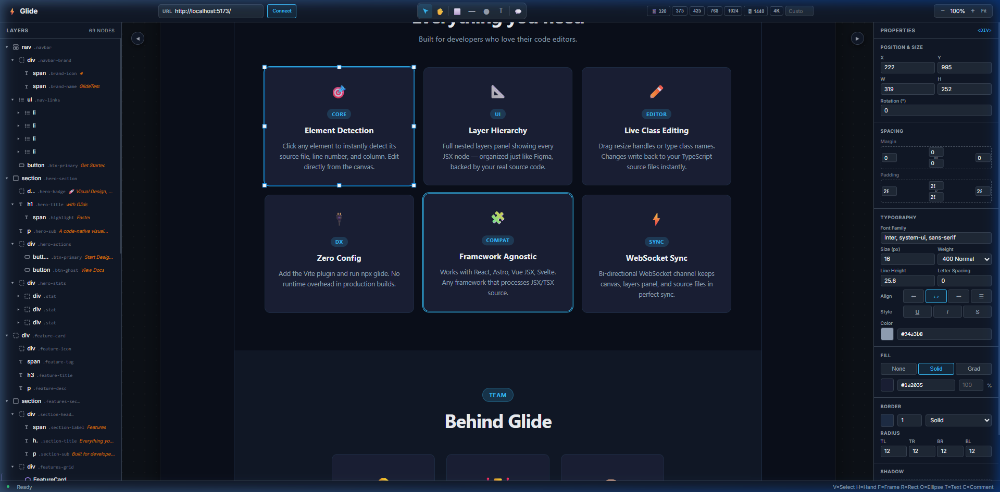
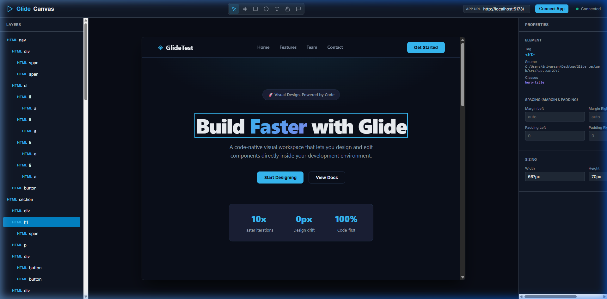

<h1 align="center">
   &nbsp; <font size="7">Glide</font>
</h1>

<p align="center">
  <i align="center">Code-native visual design workspace for React, Vue, and Svelte components 🚀</i>
</p>

<h4 align="center">
  <a href="https://github.com/srivarsank/glide/graphs/contributors">
    
  </a>
  <a href="https://opensource.org/licenses/Apache-2.0">
    
  </a>
</h4>

<p align="center">
    
</p>

## Introduction

`Glide` is a code-native visual design tool that runs a web editor inside your local development environment and writes changes directly back to React (JSX/TSX), Vue SFC, Svelte, or HTML source files using AST transformations.

Unlike traditional low-code platforms or visual builders that output proprietary code or lock you into a cloud platform, Glide operates directly on your source code. You own the code, the layout, and the environment.

<details open>
<summary>
 ⚡ Features
</summary> <br />

<p align="center">
    
&nbsp;
    
</p>

- **Visual Canvas:** Figma-like workspace supporting element selection, zoom/pan, and drag/resize.
- **Figma-Style Snapping:** Automatically aligns dragged elements to sibling edges (left, right, center, top, bottom, vertical center) and the pixel grid with visual line guides.
- **AST Write-back:** Inline edits are written back to React (JSX/TSX), Vue SFC, Svelte, or HTML source files.
- **Zero-Flicker Dragging:** Element positions are saved to a local `glide-positions.json` file to bypass full framework HMR page refreshes.
- **Tighter Layers Panel:** Figma-style hierarchical tree structure with type-specific monochrome SVG icons, element labels, and hover-only visibility controls.
- **Properties Control:** Direct styling for geometry (X, Y, W, H), margin, padding, border, radius, shadow, background/fills (solid, gradient), and typography.
- **Device Preview:** Predefined breakpoints (320px to 4K) and custom width inputs.
- **Undo/Redo History:** Stack-based undo/redo operations preserved across the server session.
</details>

## Setup

<details open>
<summary>Prerequisites</summary> <br />

Make sure you have the following prerequisites installed:
- **Node.js:** v18.0.0 or higher
- **TypeScript:** v5.0.0 or higher
- **Vite:** v5.0.0 or higher (for dev-time plugin and HMR)
</details>

<details open>
<summary>Installation</summary> <br />

1. **Clone the repository:**
   ```bash
   git clone https://github.com/srivarsank/glide.git
   cd glide
   ```

2. **Install dependencies:**
   ```bash
   npm install
   ```

3. **Build the compiler and server:**
   ```bash
   npm run build
   ```
</details>

## Usage

1. **Start your client application** (e.g., on port `5173`).
2. **Start the Glide designer server** in a separate terminal from the root of the Glide workspace:
   ```bash
   node dist/cli.js 5173
   ```
   This launches the WebSocket server on port `7777` and exposes the visual editor.
3. **Open the editor:** Navigate to `http://localhost:7777` in your browser.
4. **Connect:** Click the **Connect** button in the header to synchronize the visual designer canvas with your running client application.

## Project Structure

<details>
<summary>Repository Directory Map</summary> <br />

- **.agents/** — Local agent settings, hooks, and execution profiles.
- **.planning/** — Project requirements and agent memory states.
- **dist/** — Compiled JavaScript build output.
- **docs/** — Visual designer documentation and specifications.
- **scratch/** — Temporary scratch files and experiment logs.
- **src/** — Core source code.
  - **__tests__/** — Vitest unit test suites.
  - **assets.ts** — Local asset upload and management pipelines.
  - **bridge.ts** — Injected client script for editor iframe synchronization.
  - **cli.ts** — Command-line interface entry point.
  - **css.ts** — CSS parser and class helper.
  - **editor-html.ts** — Main editor page layout and frontend logic.
  - **history.ts** — Undo/redo stack management.
  - **html.ts** — HTML parser and AST modifier.
  - **index.ts** — Main module exports.
  - **meta.ts** — HTML metadata and responsive parser.
  - **overlay.ts** — Selection outline overlay calculations.
  - **plugin.ts** — Vite plugin for dev-time AST source stamping.
  - **properties.ts** — Property controls and CSS translators.
  - **reorder.ts** — JSX/TSX hierarchy reordering.
  - **server.ts** — HTTP server and WebSocket communication.
  - **snap.ts** — Canvas element and pixel grid snapping logic.
  - **svelte.ts** — Svelte template class modifier.
  - **text.ts** — JSX text node writer.
  - **tree.ts** — JSX parent-child component tree parser.
  - **viewport.ts** — Viewport responsive breakpoint resolver.
  - **vue.ts** — Vue SFC template class modifier.
  - **writer.ts** — Babel AST writer engine for JSX/TSX.
</details>

## Known Limitations

- **Stamping Requirement:** Snapping and editing only apply to elements tagged with `data-gl-source` attributes.
- **Non-React Editing:** CSS adjustments for Vue and Svelte template blocks are limited to className string replacements.
- **Positional Dragging:** Absolute coordinate dragging depends on writing layout offsets to a local `glide-positions.json` file in the project.
- **Resizing Bug:** Element resizing on the canvas is currently bugged and does not consistently apply.

## License

This project is licensed under the Apache License, Version 2.0. See the [LICENSE](LICENSE) file for details.