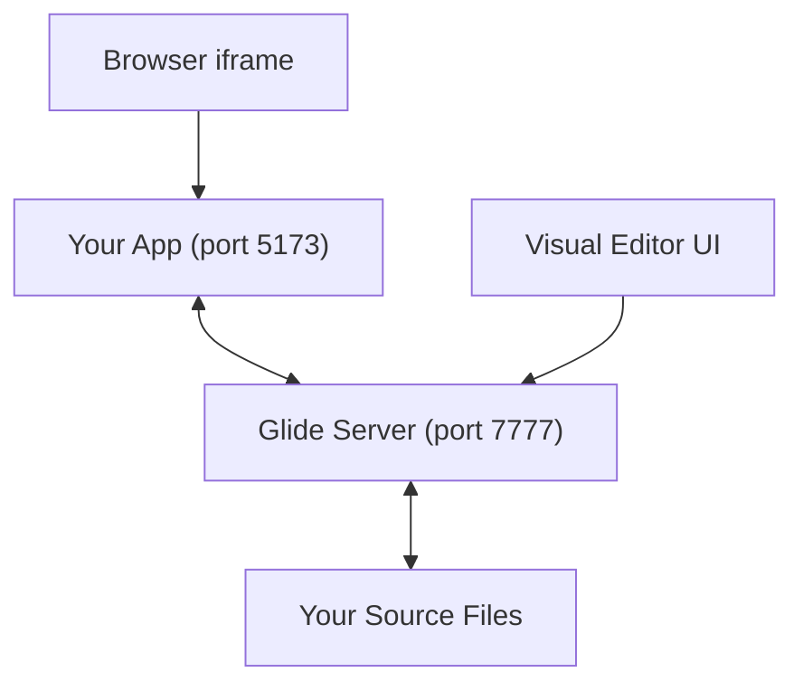

<p align="center">
  
</p>

---

## What is Glide?

**Glide** is a local visual design tool that sits on top of your existing frontend app. You open it in your browser, click on any element on screen, and edit its styles, layout, and position - just like Figma. The difference? **Every edit is written directly back to your source code** (JSX, TSX, Vue SFC, Svelte, or HTML) as real code.

No cloud. No proprietary formats. No lock-in. Just your code, edited visually.

---

## How It Works



1. Your app runs normally (e.g., `npm run dev` on port 5173)
2. Glide's server connects to it and opens a visual editor at `localhost:7777`
3. You click elements on the canvas → Glide highlights them and shows their styles
4. You change a value → Glide rewrites the source file using AST transformations

---

## Quick Start

### Prerequisites

- **Node.js** v18+
- **npm** v8+

### Step 1 - Clone and install

```bash
git clone https://github.com/srivarsank/glide.git
cd glide
npm install
```

### Step 2 - Build Glide

```bash
npm run build
```

### Step 3 - Start your frontend app

In a separate terminal, start your React/Vue/Svelte app as you normally would:

```bash
# Example (Vite app on port 5173)
npm run dev
```

### Step 4 - Start Glide

From the Glide folder, run:

```bash
node packages/cli/dist/index.js 5173
```

> Replace `5173` with whatever port your app is running on.

### Step 5 - Open the editor

Go to **http://localhost:7777** in your browser. Your app will appear inside the visual canvas. Click any element to start editing it.

---

## Features

<p align="center">
    
</p>

| Feature | Description |
|---|---|
| 🎨 **Visual Canvas** | Figma-like workspace - select, drag, resize, zoom, and pan elements |
| 📐 **Smart Snapping** | Automatically snaps to sibling edges, centers, and the pixel grid with guide lines |
| ✍️ **Live Code Write-back** | Every change is saved directly to your JSX/TSX/Vue/Svelte source files |
| ⚡ **Zero-Flicker Drag** | Positions are saved to `glide-positions.json` so dragging doesn't trigger a full HMR reload |
| 🗂️ **Layers Panel** | Hierarchical tree view of all elements, with Lucide-style icons and hover controls (like Figma) |
| 🎛️ **Properties Panel** | Edit geometry (X, Y, W, H), spacing (margin/padding), border, radius, shadows, fills, and typography |
| 🌈 **Color Picker** | Custom popup color picker with presets and hex input - no native OS dialog |
| 📱 **Device Preview** | Switch between presets or enter custom width & height. Clear height in Custom Mode to auto-scale to the full page height, and scroll inside viewports |
| 🌿 **Git Branching Mode** | Safe branching sandbox (`git: <branch> ▾`) to preview and finalise changes before commit |
| 🎛️ **Quick Toggles Navbar** | Compact header tools for snapping object/pixel options, grid layers, rulers, and custom logo/repository view |
| ↩️ **Undo / Redo** | Full undo/redo history for the entire session |

---

## Color Picker

Glide uses a **custom popup color picker** (not the native OS dialog). Click any color swatch to open it. You can:
- Pick from 16 preset colors
- Type a hex code directly
- Use the **🧪 eyedropper button** to sample a color from the screen

> ⚠️ **Known Bug - Eyedropper Tool:** The eyedropper button (`🧪`) is currently buggy in some Chromium versions. It may not close the color picker after picking, or it may fail to register the sampled color. **Avoid using it for now.** Use hex input or presets instead.

---

## Keyboard Shortcuts

| Key | Tool |
|---|---|
| `V` | Select tool |
| `H` | Hand / Pan tool |
| `F` | Frame |
| `R` | Rectangle |
| `O` | Ellipse |
| `T` | Text |
| `C` | Comment |
| `Ctrl+Z` | Undo |
| `Ctrl+Shift+Z` | Redo |
| `Escape` | Deselect / Close popup |

---

## Project Structure

```
Glide/
├── packages/
│   ├── cli/            # Entry point - run this to start Glide
│   ├── overlay/        # The visual editor UI (HTML/JS served at localhost:7777)
│   ├── server/         # WebSocket + HTTP server that connects to your app
│   ├── core/           # Shared types, AST scanner utilities
│   ├── ast-writer/     # Writes style changes back to JSX/TSX/Vue/Svelte source
│   └── vite-plugin/    # Vite plugin that stamps elements with source locations
├── docs/               # Extra documentation and design specs
├── logo/               # Logo assets
└── README.md
```

---

## Known Issues

| Issue | Status |
|---|---|
| 🐛 **Eyedropper tool** - may not close or apply the picked color correctly | **Bugged - avoid for now** |
| 🐛 **Element resizing** - canvas resize handles don't consistently apply changes | **Bugged** |
| ⚠️ **Vue / Svelte editing** - only className string replacements are supported, not full style objects | Partial support |
| ⚠️ **Stamping required** - snapping and editing only work on elements tagged with `data-gl-source` by the Vite plugin | By design |
| ⚠️ **Absolute drag positions** - dragged positions are stored in `glide-positions.json`, not written to source layout | By design |

---

## License

This project is licensed under the [Apache License 2.0](LICENSE).