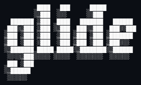
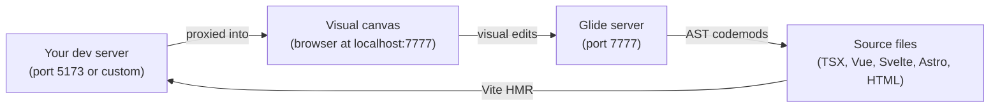
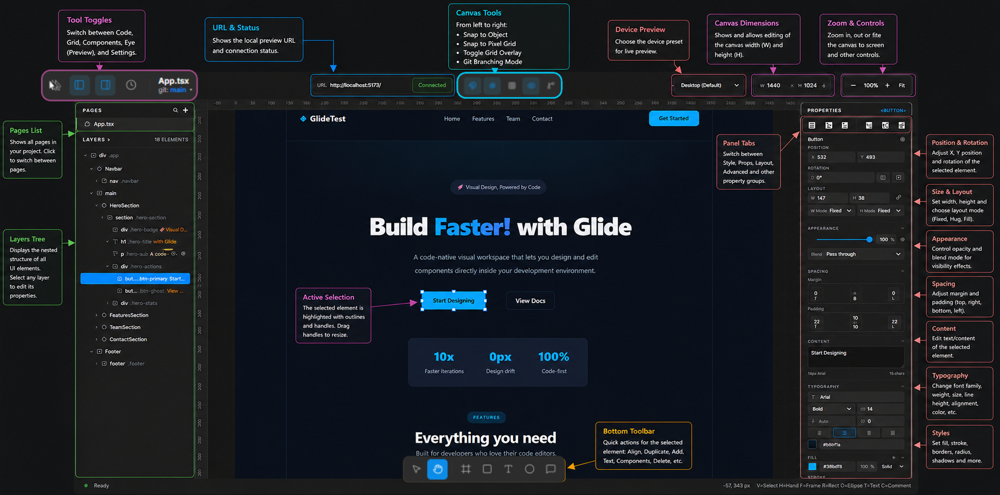

<p align="center">
  
</p>

<p align="center">
  <strong>Local visual design tool for React, Vue, Svelte, and Astro.</strong><br>
  Select elements on a live canvas, adjust styles and layout visually, and write changes directly back to your source files.
</p>

<p align="center">
  <a href="https://www.npmjs.com/package/@srivarsank/glide"></a>
  <a href="https://github.com/SrivarsanK/Glide/pkgs/npm/glide"></a>
  <a href="https://github.com/SrivarsanK/Glide/actions/workflows/ci.yml"></a>
  
  
  
</p>

---

## What is Glide?

Glide is a local visual editor for frontend projects. It runs in your browser and connects to your local dev server, letting you select elements on screen, move them, and change their styling.

Unlike design tools that export mockups or save into closed formats, Glide modifies your actual source files. When you change a color, adjust padding, or drag an element into a new container, Glide runs an AST codemod on your JSX, TSX, Vue, Svelte, Astro, or HTML files. Your code remains clean, formatting stays intact, and you stay in control of version control.

---

## How it works

Glide uses an iframe proxy on port 7777 to display your running app. A local WebSocket server coordinates visual interactions with your files.


```mermaid
flowchart LR
    App["Your dev server\n(port 5173 or custom)"]
    Server["Glide server\n(port 7777)"]
    Canvas["Visual canvas\n(browser at localhost:7777)"]
    Files["Source files\n(TSX, Vue, Svelte, Astro, HTML)"]

    App -->|"proxied into"| Canvas
    Canvas -->|"visual edits"| Server
    Server -->|"AST codemods"| Files
    Files -->|"Vite HMR"| App
```

1. Run your dev server as usual (for example, `npm run dev` on port 5173).
2. Start Glide with `npx @srivarsank/glide 5173`.
3. Open `http://localhost:7777`. Glide proxies your app and overlays an editing chrome.
4. Click elements on the canvas to inspect their properties, adjust styles, or drag them.
5. Glide updates your source code with targeted AST modifications.
6. Changes you make outside Glide in your code editor automatically update the canvas through bidirectional sync, without reloading the iframe.

---

## Architecture: The Figma and v0 model

Glide combines the spatial responsiveness of canvas tools with bidirectional AST synchronization:

```
Canvas edits                          External code edits
     │                                         │
     ▼                                         ▼
In-memory scene graph (cached bounds)   Chokidar file watcher
     │                                         │
     ▼                                         ▼
WebSocket codemod dispatch              JSX coordinate parser
     │                                         │
     ▼                                         ▼
Property delta queue (LWW)              Scene update event
     │                                         │
     ▼                                         ▼
Source file recast and write-back       Overlay patches scene graph
```

- **In-memory scene graph:** Instead of calling browser `document.elementFromPoint`, which can break under CSS transforms and canvas zoom, Glide caches an in-memory spatial index of element bounds. This delivers reliable hit-testing under arbitrary scaling.
- **Surgical Tailwind updates:** When updating utility classes, Glide replaces only the targeted property prefix (such as `bg-` or `text-`). Surrounding layout, flex, and responsive classes remain untouched.
- **Property-level conflict resolution:** Edits track logical timestamps per property (`nodeId:propKey`). If one person or tool adjusts width while another adjusts color on the same element, neither edit clobbers the other.
- **Staged edits buffer:** You can batch visual adjustments across multiple components and review them in a staging bar before committing changes to disk.
- **Zero-flicker dragging:** Real-time drag positions write to `glide-positions.json` during motion, avoiding rapid Vite HMR restarts on every mouse move.

---

## Quick start

Glide is available on the public npm registry and GitHub Packages.

### Option A: Run directly via npx

Start your app in one terminal, then point Glide at its port:

```bash
# Terminal 1: your app
npm run dev

# Terminal 2: start Glide targeting your app's port
npx @srivarsank/glide 5173
```

Then open **http://localhost:7777** in your browser.

### Option B: Install as a dev dependency

```bash
npm install -D @srivarsank/glide
```

You can add a script to `package.json`:

```json
{
  "scripts": {
    "glide": "glide 5173"
  }
}
```

### Option C: GitHub Packages

If your team consumes packages from GitHub Packages:

1. Add the scope mapping to your `.npmrc`:
   ```ini
   @srivarsank:registry=https://npm.pkg.github.com
   ```
2. Authenticate with a personal access token:
   ```bash
   npm login --registry=https://npm.pkg.github.com
   ```
3. Run via npx:
   ```bash
   npx @srivarsank/glide 5173
   ```

---

## Vite plugin configuration

To enable click-to-element mapping, add the `glideSourceStamping` plugin to your Vite configuration. This stamps elements with source file locations during development.

**React (`vite.config.ts`):**
```ts
import { defineConfig } from 'vite';
import react from '@vitejs/plugin-react';
import { glideSourceStamping } from '@srivarsank/glide/vite-plugin';

export default defineConfig({
  plugins: [react(), glideSourceStamping()],
});
```

**Vue (`vite.config.ts`):**
```ts
import { defineConfig } from 'vite';
import vue from '@vitejs/plugin-vue';
import { glideSourceStamping } from '@srivarsank/glide/vite-plugin';

export default defineConfig({
  plugins: [vue(), glideSourceStamping()],
});
```

**Svelte (`vite.config.ts`):**
```ts
import { defineConfig } from 'vite';
import { svelte } from '@sveltejs/vite-plugin-svelte';
import { glideSourceStamping } from '@srivarsank/glide/vite-plugin';

export default defineConfig({
  plugins: [svelte(), glideSourceStamping()],
});
```

**Astro (`astro.config.mjs`):**
```ts
import { defineConfig } from 'astro/config';
import { glideSourceStamping } from '@srivarsank/glide/vite-plugin';

export default defineConfig({
  vite: {
    plugins: [glideSourceStamping()],
  },
});
```

**Plain HTML with Vite:**
```ts
import { defineConfig } from 'vite';
import { glideSourceStamping } from '@srivarsank/glide/vite-plugin';

export default defineConfig({
  plugins: [glideSourceStamping()],
});
```

---

## AI agent skills

Glide includes bundled skills that teach AI assistants (including Antigravity IDE, Claude Code, Cursor, Windsurf, and GitHub Copilot) how to inspect and modify components directly through Glide.

### Installing skills

Run the installer from your project root:

```bash
npx @srivarsank/glide --install-skills
```

This installs three structured skills into `.agents/skills/`:
- `glide`: Architecture guide, SceneGraph hit testing, and visual editing patterns.
- `glide-component-segregator`: Component registry lookup using `glide-components.json`.
- `glide-setup`: Setup and configuration steps for all supported frameworks.

If you use Cursor, the installer also creates `.cursor/rules/glide.mdc`.

### The component registry (`glide-components.json`)

When Glide starts, it indexes every component in your project into `glide-components.json`. AI agents use this registry to locate components by name rather than searching raw file trees:

```json
{
  "buckets": [
    {
      "name": "Card",
      "file": "/src/components/Card.tsx",
      "exportType": "named",
      "line": 12,
      "elements": [
        { "id": "src/Card.tsx:13:4", "tagName": "div", "isRoot": true, "classNames": ["card"] },
        { "id": "src/Card.tsx:14:6", "tagName": "h2", "isRoot": false }
      ],
      "cssFiles": ["/src/components/Card.module.css"]
    }
  ]
}
```

The file automatically updates within 300 ms whenever you create, rename, or delete components.

Add these cache files to your `.gitignore`:
```gitignore
glide-components.json
glide-positions.json
```

### Agent workflow

When an AI assistant needs to modify a component visually, it follows these steps:
1. Read `glide-components.json`.
2. Locate the bucket matching the component name (such as "Card" or "Header").
3. Inspect elements to find the target `data-gl-source` id by tag name, root wrapper, or classes.
4. For CSS module modifications, open the file listed in `cssFiles`.
5. Apply the surgical edit and verify on canvas.

---

## Features

<p align="center">
  
</p>

| Feature | Description |
|---|---|
| Visual canvas | Select, drag, resize, zoom, and pan elements on a live canvas |
| In-memory scene graph | Fast spatial index with zoom- and transform-aware hit testing |
| Bidirectional sync | External code changes update the canvas without reloading the page |
| Smart snapping | Snaps to sibling edges, centers, and grid lines with visual guides |
| Universal code write-back | Direct source editing across React, Vue, Svelte, Astro, and HTML |
| Surgical Tailwind rewriter | Replaces specific utility tokens while preserving other classes |
| Canvas reparenting | Drag elements between containers to update parent-child JSX structure |
| Component definition jump | Jump from an instantiated sub-component to its origin file in one click |
| Property-level delta queue | Independent clocks per property prevent conflicting writes |
| Astro framework support | Full `.astro` component editing with frontmatter preservation |
| Smooth dragging | Interim drag positions write to `glide-positions.json` without HMR restarts |
| Layers panel | Hierarchical element tree with visibility and selection controls |
| Properties panel | Control dimensions, margins, padding, borders, shadows, and typography |
| Color picker | Custom popup picker with hex input and preset palettes |
| Device preview | Toggle between responsive presets or define custom canvas dimensions |
| Git sandbox mode | Test visual changes on a dedicated branch before committing |
| Quick toggles bar | Compact controls for snapping, pixel grid, rulers, and file paths |
| Undo and redo | Full session history with undo and redo controls |
| Component registry | Automatic component indexing saved to `glide-components.json` |

---

## Keyboard shortcuts

| Key | Action |
|---|---|
| `V` | Select tool |
| `H` | Hand and pan tool |
| `F` | Frame tool |
| `R` | Rectangle tool |
| `O` | Ellipse tool |
| `T` | Text tool |
| `C` | Comment tool |
| `Ctrl+Z` | Undo |
| `Ctrl+Shift+Z` | Redo |
| `Escape` | Deselect or close modal |

---

## Color picker

Glide uses a custom popup color picker rather than the native operating system dialog. Click any color swatch in the properties panel to open it.

You can select from 16 presets, type a hex color code, or use the eyedropper tool. Note that on some Chromium builds, the browser eyedropper API can occasionally fail to close; typing hex codes or choosing presets is recommended if you encounter this browser issue.

---

## Project structure

```
Glide/
├── packages/
│   ├── cli/            # CLI launcher (npx @srivarsank/glide)
│   ├── overlay/        # Visual canvas overlay (served at localhost:7777)
│   ├── server/         # WebSocket and HTTP proxy server
│   ├── core/           # Shared types, AST scanner, and component registry
│   ├── ast-writer/     # Recast and Babel source file codemods
│   ├── adapters/       # Framework adapters (React, Vue, Svelte, Astro, HTML)
│   └── vite-plugin/    # Source stamping plugin (glideSourceStamping)
├── skills/             # Bundled AI agent skills
│   ├── glide/
│   ├── glide-component-segregator/
│   └── glide-setup/
├── docs/               # Research notes and specifications
├── logo/               # Assets
└── README.md
```

---

## Contributing

Contributions are welcome.

- Review the [Contributing Guide](CONTRIBUTING.md) for local architecture details and testing procedures.
- We follow conventional commit conventions for atomic commits.
- Check [docs/research/](docs/research/) for background on AST codemods and spatial scene graph design.

---

## License

This project is licensed under the [Apache License 2.0](LICENSE).

---

## Star history

<a href="https://www.star-history.com/?repos=srivarsank%2Fglide&type=date&legend=bottom-right">
  <picture>
    <source media="(prefers-color-scheme: dark)" srcset="https://api.star-history.com/chart?repos=srivarsank/glide&type=date&theme=dark&legend=bottom-right" />
    <source media="(prefers-color-scheme: light)" srcset="https://api.star-history.com/chart?repos=srivarsank/glide&type=date&legend=bottom-right" />
    
  </picture>
</a>
