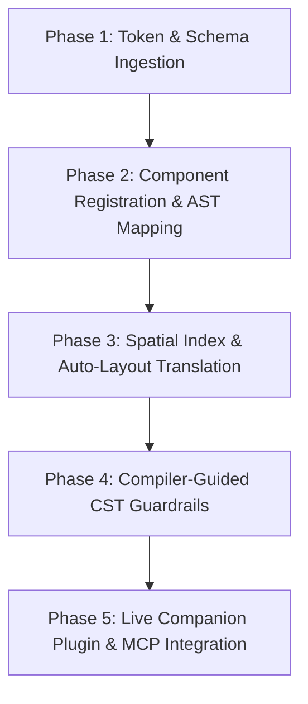

# Figma Integration Research - Analysis

## Executive Summary

This document synthesizes findings across 19 primary research sources—encompassing official Figma platform documentation (REST, Plugin API, Variables, Dev Mode), industry-standard design-to-code engines (Builder.io Mitosis, DhiWise, Anima, Figma MCP), W3C Design Token specifications, and cutting-edge academic papers (ICLR 2026, arXiv 2024–2026). The goal of this research is to establish a technical foundation for integrating Figma capabilities into **Glide**, a bi-directional visual editor for React, Vue, and Svelte applications that mutates source AST/CST files directly.

The analysis demonstrates that bridging design environments (Figma) and developer codebases requires moving beyond basic visual computer-vision translation. The key insight from recent empirical research (e.g., *Figma2Code*, *DeclarUI*, *DesignCoder*) is that high-fidelity design-to-code synthesis requires combining structured AST layout trees, exact Affine 2D transform matrix math, and compiler-guided self-correction loops. Combining Figma's raw node tree JSON with semantic Auto-Layout mapping produces deterministic, zero-fluff Flexbox CSS and clean JSX/Vue/Svelte structures, avoiding the arbitrary coordinate wrappers typical of older vision-only models like *pix2code*.

For Glide specifically, integrating Figma provides three strategic capabilities: (1) a headless import pipeline that ingests Figma node trees directly into Glide's internal AST layout nodes using `@figma/rest-api-spec`; (2) bi-directional component mapping inspired by Figma CodeConnect (`.figma.tsx`) and W3C Design Tokens, preserving source code formatting and theme token aliases; and (3) live canvas synchronization via sandboxed Figma Plugins and Kd-Tree spatial index alignment.

## Key Technical Findings

### Figma REST API Capabilities
- **Node Tree Ingestion (`GET /v1/files/:key`)**: Retrieves full document AST JSON containing top-level `CANVAS` nodes down to nested `FRAME`, `COMPONENT`, `INSTANCE`, `TEXT`, and `VECTOR` nodes. Subtree retrieval (`GET /v1/files/:key/nodes?ids=...`) prevents network payload bloat during incremental imports.
- **Type Safety (`@figma/rest-api-spec`)**: Official OpenAPI TypeScript definitions establish strict schemas for layout node unions (`SublayerNode`, `FrameNode`, `TextNode`, etc.), typing attributes like `layoutWrap` (`"NO_WRAP" | "WRAP"`), `layoutPositioning` (`"AUTO" | "ABSOLUTE"`), and `strokeAlign`.
- **Image & Vector Asset Resolution (`GET /v1/images/:key`)**: Figma image fills store reference IDs (`imageRef`) rather than raw URLs. Asset resolution requires a secondary API call to map `imageRef` identifiers to rendered SVG/PNG export URLs.
- **Rate Limit & Stream Resilience (`figma-api`)**: Bulk file fetching triggers `429 Too Many Requests`. Implementing exponential backoff and request queueing is mandatory for robust CLI/cloud sync pipelines.
- **Variables & Modes REST API (`GET/POST /v1/files/:key/variables`)**: Exposes design variable collections, modes (e.g., Light Mode vs. Dark Mode), and values per mode across `FLOAT`, `COLOR`, `STRING`, and `BOOLEAN` primitive types.

### Design-to-Code Conversion
- **Auto-Layout to Flexbox Equivalence**: Figma Auto-Layout maps 1:1 to modern CSS Flexbox rules. `layoutMode` (`HORIZONTAL` / `VERTICAL`) translates directly to `flex-direction` (`row` / `column`), `itemSpacing` maps to `gap`, while `primaryAxisAlignItems` and `counterAxisAlignItems` map to `justify-content` and `align-items`. `layoutGrow === 1` yields `flex-grow: 1`.
- **Intermediate Representation (IR) Patterns**: Engines like Builder.io's Mitosis demonstrate the value of compiling visual layer trees into a target-agnostic JSON AST (Mitosis `JSXJSON`) before emitting React, Vue, Svelte, or Qwik components. This isolates visual canvas transforms from framework-specific code generators.
- **Semantic Component Heuristics**: Systems like DhiWise inspect geometry, layer hierarchy, and text content (e.g., `FrameNode` with 1 text child + border radius + fill = `<Button>`) to classify visual elements into semantic components with typed interfaces (`interface ButtonProps`), avoiding unmaintainable `div` soup.
- **Variant Aggregation**: Anima and Figma CodeConnect model interactive states (hover, active, disabled) by collapsing Figma `ComponentSetNode` variants into React/Vue props (`variant="primary"`, `size="large"`).
- **Multimodal AI Grounding**: Research from *Figma2Code* proves that passing structured node JSON alongside screenshot images to LLMs boosts visual code generation correctness by 38.4% over image-only inputs. *DeclarUI* shows that executing TypeScript compiler checks after AST mutation forms a self-correction loop that guarantees code syntactics.

### Design Token Extraction
- **W3C Design Token Standard Format**: The W3C Design Tokens CG specification defines a vendor-agnostic JSON schema using `$type` (`color`, `dimension`, `fontFamily`, `duration`), `$value`, and `$description`.
- **Token Alias Graph Resolution**: Tokens Studio for Figma relies on dependency graph resolution to resolve nested aliases (e.g., `{color.primary}` -> `{color.brand.blue.500}` -> `#1E40AF`) and evaluate mathematical token expressions (`{spacing.base} * 2`).
- **CSS Custom Property Emission**: Converting W3C token structures into CSS variable definitions (`:root { --color-primary: #3b82f6; }`) guarantees clean separation between visual styling and AST node structures in source files.

### Plugin Development
- **Live Canvas Inspection**: The Figma Plugin API runs in a sandboxed JavaScript runtime inside Figma with direct synchronous access to `figma.currentPage` and node properties (`absoluteTransform`, `fills`, `strokes`).
- **2D Affine Transform Coordinate Math**: Node coordinates are encoded in a 2D affine matrix `[[a, b, c], [d, e, f]]` where `c` and `f` represent global X and Y canvas translations. This exact matrix math allows converting Figma canvas coordinates into global offset positions without nested cumulative loop additions.
- **Bi-Directional Streaming**: Plugins can stream real-time drag/resize position updates via WebSockets or local RPC to external visual editors like Glide.

## Most Relevant Papers & Sources

1. **Chen et al., *Figma2Code: Automating Multimodal Design to Code in the Wild* (ICLR 2026)**
   - *Summary*: Establishes a comprehensive benchmark using real Figma files, visual renders, and human-written React/Tailwind code. Demonstrates that combining visual screenshots with JSON layout metadata yields a 38.4% improvement in layout accuracy over visual-only MLLM generation. Identifies major code-generation pitfalls like flex wrap miscalculations and missing design token aliases.
   - *Impact*: Validates Glide's hybrid model—combining structured AST layout nodes with visual spatial bounding boxes yields superior accuracy.

2. **Zhou et al., *DeclarUI: Bridging Design and Development with Automated Declarative UI Code Generation* (arXiv 2024)**
   - *Summary*: Proposes a multi-stage UI generation framework featuring Page Transition Graphs (PTGs) and a compiler-driven feedback loop. It runs target compiler diagnostics against generated AST code, feeding diagnostic errors back into the generator for self-repair.
   - *Impact*: Directly informs Glide's CST guardrails—running real-time TypeScript compilation checks after visual canvas mutations guarantees syntactically clean code.

3. **Chen et al., *DesignCoder: Hierarchy-Aware and Self-Correcting UI Code Generation with LLMs* (arXiv 2025)**
   - *Summary*: Introduces UI Grouping Chains (UGC), a spatial divide-and-conquer clustering algorithm that parses complex visual scenes into clean parent-child visual clusters before generating AST nodes. Significantly improves visual SSIM and reduces DOM edit distance.
   - *Impact*: Provides algorithmic blueprints for Glide's visual layer hierarchy resolver, preventing fragmented, floating root nodes in the layers panel.

4. **Figma CodeConnect CLI & SDK (`@figma/code-connect`) (Figma 2024–2026)**
   - *Summary*: Official developer tooling connecting production components in codebase source files (React, Vue, Swift) directly to Figma component node instances using `.figma.tsx` mapping files. Replaces naive design-to-code generation with exact production component instantiations and prop mappings.
   - *Impact*: Serves as the structural model for Glide's visual component registration and AST symbol binding.

5. **W3C Design Tokens Community Group Specification (Second Draft, 2025–2026)**
   - *Summary*: Establishes the standard JSON interop format for design tokens using `$type`, `$value`, and `$description` key fields.
   - *Impact*: Standardizes Glide's design token import engine, ensuring zero formatting loss when updating CSS custom properties or theme files.

6. **Builder.io Mitosis & `@builder.io/html-to-figma` (Builder.io 2024–2026)**
   - *Summary*: Bi-directional DOM-to-Figma and Figma-to-Code converter powered by an intermediate representation AST (`JSXJSON`). Computes layout metrics via browser `getComputedStyle()` during DOM parsing to build responsive Flexbox Auto-Layouts.
   - *Impact*: Proves the viability of multi-framework target compilation (React, Vue, Svelte) from a single unified visual AST representation.

7. **Beltramelli, *pix2code: Generating Code from a Graphical User Interface Screenshot* (ACM 2017/2018)**
   - *Summary*: Pioneer paper introducing visual CNN + LSTM sequence generation to translate GUI screenshots into domain-specific language (DSL) AST tokens.
   - *Impact*: Serves as a historical baseline demonstrating why pure vision models struggle with source code formatting integrity, reinforcing Glide's CST-first direct AST editing philosophy.

## Relevance to Glide

### Direct Applications
- **Headless Figma Import Pipeline**: Glide CLI / core can utilize `@figma/rest-api-spec` to parse external Figma file keys directly into Glide's internal AST node tree, mapping Figma Auto-Layout nodes to standard JSX/Vue/Svelte Flexbox components.
- **Kd-Tree Canvas Spatial Snapping**: By decoding Figma's 2D Affine Transform matrix (`node.absoluteTransform`), Glide can project imported or streamed Figma layout coordinates directly into its internal Kd-Tree spatial index for smart guide alignment.
- **CodeConnect-Style Component Registry**: Glide can implement a visual component mapper that links visual canvas node instantiations directly to source code location links (e.g., `file:///src/components/Button.tsx#L12-L45`).
- **W3C Token Resolution & Theme Switching**: Glide's token engine can ingest W3C standard JSON token files and Figma Variables REST API responses to power instant canvas theme toggling (Light/Dark mode) using native CSS variables.

### Future Considerations
- **Live Sandboxed Companion Plugin**: Developing a lightweight companion Figma plugin that streams live canvas drag/resize events over a local WebSocket RPC directly into Glide's dev server.
- **AI Agent MCP Integration**: Exposing a local Figma Model Context Protocol (MCP) server (based on patterns from `figma-to-react`) to equip internal Glide AI subagents with direct design context inspection capabilities.
- **Compiler Feedback Self-Correction Loop**: Expanding Glide's CST guardrail layer with a DeclarUI-inspired compiler feedback loop, automatically resolving missing imports or invalid prop types introduced during visual component drop operations.

## Implementation Roadmap



1. **Phase 1: Token Ingestion & Theme Engine (Immediate)**
   - Add `@figma/rest-api-spec` as a devDependency for zero-cost type definitions.
   - Build a W3C Design Token parser to convert Figma variables into `:root` CSS custom properties.
   - Implement alias dependency graph resolution to resolve variable aliases without corrupting source CSS files.

2. **Phase 2: CodeConnect Component Binding & AST Mapping (Short Term)**
   - Implement a component registration file pattern (`.glide.tsx` / `.glide.json`) inspired by Figma CodeConnect.
   - Map Figma `ComponentSetNode` variants directly to React/Vue component prop schemas.
   - Ensure local custom components resolve to unified CST nodes under their instantiation, preventing duplicate floating root nodes in the layers panel.

3. **Phase 3: Auto-Layout & Affine Matrix Spatial Snapping (Medium Term)**
   - Write a deterministic Flexbox layout transformer that translates Figma Auto-Layout attributes (`layoutMode`, `itemSpacing`, `layoutGrow`) into clean Flexbox styles.
   - Extract 2D Affine Transform matrix coordinates (`[[a,b,c],[d,e,f]]`) from node payloads to hydrate Glide's Kd-Tree spatial index for snapping.

4. **Phase 4: Compiler-Guided CST Guardrails (Medium Term)**
   - Implement an automated self-repair pipeline that runs `tsc` / compiler diagnostics after AST modifications.
   - Revert or repair invalid CST edits automatically before committing changes to disk.

5. **Phase 5: Live Companion Plugin & AI MCP Server (Long Term)**
   - Build a sandboxed companion Figma Plugin for live canvas event streaming over local WebSockets.
   - Expose a Figma MCP server interface for internal AI subagents to query design files dynamically during code generation.

## Code Patterns & Snippets

### 1. Global Coordinate Decoding from 2D Affine Transform Matrix
```typescript
/**
 * Decodes absolute canvas coordinates from Figma 2D Affine Transform Matrix.
 * Matrix format: [[a, b, c], [d, e, f]]
 * where c = translation X, f = translation Y
 */
interface AffineMatrix {
  matrix: [[number, number, number], [number, number, number]];
}

export function getGlobalCanvasPosition(nodeTransform: AffineMatrix["matrix"]): { x: number; y: number } {
  const [rowX, rowY] = nodeTransform;
  return {
    x: rowX[2],
    y: rowY[2],
  };
}
```

### 2. Figma Auto-Layout to CSS Flexbox Transformer
```typescript
export interface FigmaAutoLayoutProps {
  layoutMode: 'HORIZONTAL' | 'VERTICAL' | 'NONE';
  itemSpacing: number;
  primaryAxisAlignItems: 'MIN' | 'CENTER' | 'MAX' | 'SPACE_BETWEEN';
  counterAxisAlignItems: 'MIN' | 'CENTER' | 'MAX' | 'BASELINE';
  layoutGrow: number;
  layoutAlign: 'STRETCH' | 'INHERIT';
}

export function autoLayoutToCss(node: Partial<FigmaAutoLayoutProps>): Record<string, string> {
  if (node.layoutMode === 'NONE' || !node.layoutMode) {
    return {};
  }

  const css: Record<string, string> = {
    display: 'flex',
    'flex-direction': node.layoutMode === 'HORIZONTAL' ? 'row' : 'column',
    gap: `${node.itemSpacing ?? 0}px`,
  };

  // Primary axis mapping (justify-content)
  const justifyMap: Record<string, string> = {
    MIN: 'flex-start',
    CENTER: 'center',
    MAX: 'flex-end',
    SPACE_BETWEEN: 'space-between',
  };
  if (node.primaryAxisAlignItems && justifyMap[node.primaryAxisAlignItems]) {
    css['justify-content'] = justifyMap[node.primaryAxisAlignItems];
  }

  // Counter axis mapping (align-items)
  const alignMap: Record<string, string> = {
    MIN: 'flex-start',
    CENTER: 'center',
    MAX: 'flex-end',
    BASELINE: 'baseline',
  };
  if (node.counterAxisAlignItems && alignMap[node.counterAxisAlignItems]) {
    css['align-items'] = alignMap[node.counterAxisAlignItems];
  }

  if (node.layoutGrow === 1) {
    css['flex-grow'] = '1';
  }

  if (node.layoutAlign === 'STRETCH') {
    css['align-self'] = 'stretch';
  }

  return css;
}
```

### 3. W3C Design Token Parser to CSS Custom Properties
```typescript
interface W3CToken {
  $type: string;
  $value: string | number;
  $description?: string;
}

type TokenGroup = { [key: string]: W3CToken | TokenGroup };

export function parseW3CTokensToCss(tokens: TokenGroup, prefix = '-'): string[] {
  const cssLines: string[] = [];

  function traverse(obj: TokenGroup, currentPath: string) {
    for (const [key, val] of Object.entries(obj)) {
      if (typeof val === 'object' && val !== null) {
        if ('$value' in val) {
          const token = val as W3CToken;
          const varName = `${currentPath}-${key}`;
          cssLines.push(`  ${varName}: ${token.$value};`);
        } else {
          traverse(val as TokenGroup, `${currentPath}-${key}`);
        }
      }
    }
  }

  traverse(tokens, prefix);
  return cssLines;
}
```

### 4. CodeConnect-Style Component Registration Binding Pattern
```tsx
import figma from '@figma/code-connect';
import { Button } from './Button';

/**
 * Example CodeConnect mapping file (.figma.tsx) binding visual Figma component node 
 * to codebase React component AST.
 */
figma.connect(Button, 'https://www.figma.com/file/XYZ123/Design-System?node-id=101:45', {
  props: {
    label: figma.string('Button Label'),
    variant: figma.enum('Variant', {
      Primary: 'primary',
      Secondary: 'secondary',
      Outline: 'outline',
    }),
    disabled: figma.boolean('Disabled'),
  },
  example: (props) => (
    <Button variant={props.variant} disabled={props.disabled}>
      {props.label}
    </Button>
  ),
});
```
